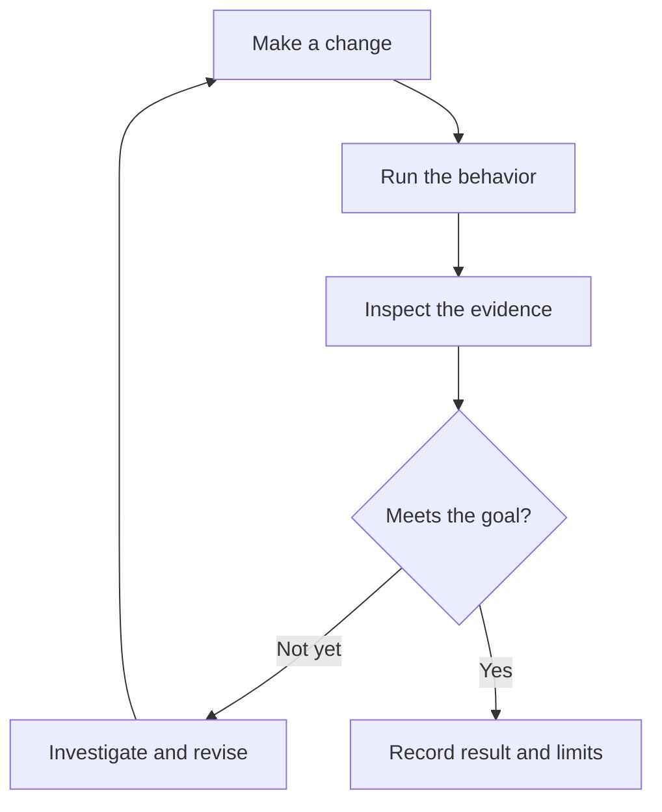

An agent can make a change and still get it wrong. To improve the result, it needs a way to run the relevant behavior and see what happened. Then it can compare that result with the goal and try again.

That's the idea behind an agent verification loop. In [Lauren Tan's interview with Matt Pocock](/notes/poteto-pstack-agent-workflows), especially 00:16:14–00:24:50, Tan describes giving agents access to a running app, browser interactions, traces, and performance measurements. Before that, she had to pass the results back herself.

This diagram is a synthesis of that process:

## Give the agent something useful to check

The check needs to match the task. If the agent is trying to make something faster, it needs relevant measurements. If it's changing an interaction, it needs to try that interaction and inspect the result. An explanation of why the code should work doesn't give it the same feedback.

Repeatable setup and evidence collection can live in scripts or tools. That way, each run can use the same process instead of building its own debugging tools again. When a check fails, the agent has a reason to investigate and make another change.

These are lessons drawn from the interview. The right checks still depend on the work.

## A passing check has limits

A check only covers the behavior and conditions it actually tests. At 00:55:44–00:59:26, the speakers discuss irreversible changes and work that's difficult to verify. They don't arrive at a complete answer.

Tan also describes agents merging changes in her environment. That doesn't establish that another project can use the same approach just because it has tests.

If you keep telling an agent to check its work, look at what's missing. [Past chats can help reveal that pattern](/notes/learning-agent-workflows-from-chats). The useful change may be giving the agent access to the result it needs to inspect.
