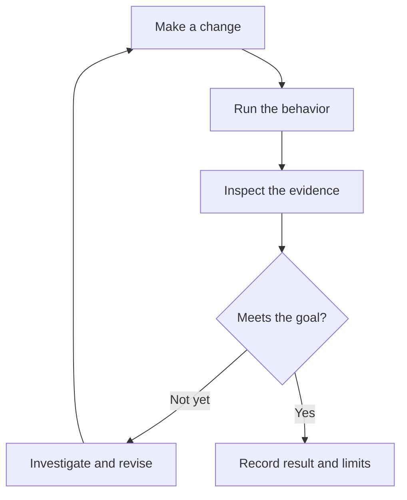

An agent verification loop connects a proposed change to observable evidence about its result. The agent executes the relevant behavior, inspects what happened, compares it with the intended outcome, and uses the difference to guide another change.

In [Lauren Tan's interview with Matt Pocock](/notes/poteto-pstack-agent-workflows), especially 00:16:14–00:24:50, this means giving coding agents access to a running application, user-like interaction, traces, and performance measurements. Tan describes verification as the capability that allowed her to stop manually relaying every result.

The following diagram summarizes this interpretation of the verification loop:

## What makes the loop useful

- The agent can observe the behavior it is changing, rather than relying only on its own explanation of the code.
- The check addresses the intended outcome. A performance task needs relevant measurements; a user interaction needs evidence that the interaction works.
- Repeatable setup and evidence collection can be packaged into deterministic tools so each run does not invent its own verification machinery.
- Failed checks lead to investigation and another attempt rather than being treated as completion.

These points are a synthesis of the interview, not a universal verification specification. The appropriate evidence depends on the task.

## Confidence has a scope

A passing check supports only the behavior and conditions it exercises. The interview's later discussion, at 00:55:44–00:59:26, leaves difficult questions about irreversible changes and poorly verifiable domains unresolved. Tan's reported autonomous merges should therefore be read as a description of her environment, not a general consequence of having tests.

When repeated human corrections concern missing verification, [learning workflows from past chats](/notes/learning-agent-workflows-from-chats) provides a way to identify which step is absent and improve the process.
